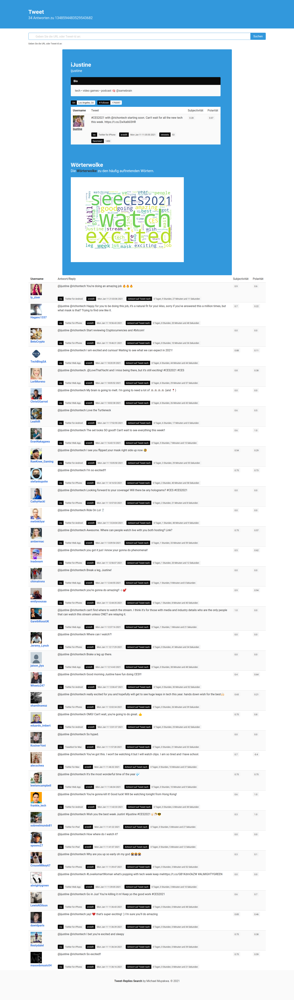

# Twitter replies

## English

>This is the first major project I have done with `Flask`.
>
>The aim was to get better insight into reactions to `Twitter posts`.

### Deutsch

>Dies ist mein erstes größeres Projekt, das ich mit `Flask` umgesetzt habe.
>
>Ziel war es besseren Einblick auf Reaktionen zu `Twitter-Beiträgen` zu erhalten.

## Python3

Mainly using `tweepy` ([link](https://www.tweepy.org/)) to use the Twitter-API.

You will need a developer-key from Twitter. [link](https://developer.twitter.com/en)

## Docker

This Flask-App ist ready to ship with Docker.
You will need to provide the ".env"-file in the "docker-compose"-file.

## Todo's

- [X] MultiThreading - (`futures` implemented from `cuncurrent`, but the improvement is not good enough.)
- [ ] Adding external Worker with `redis` and `celery`. - (Will try to add these to the `docker-compose`.)
- [ ] Trying other methods to unblock the request-time tweepy needs to gather information from Twitter.

### Screenhots

